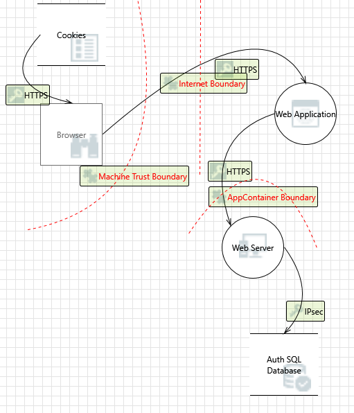

# Horizon Studios Challenge

Horizon Studios is an up and coming game development company. They recently launched a game called `Rivers Edge` which has taken the world by storm and has left the owners in dire need of assistance. With this sudden surge in popularity Horizon Studios is suffering from massive user demands, scalability and to the newly successful owners horror Cyber Security Breaches. With these concerns in mind Horizon Studios has decided to enlist your services to help identify their existing problems and implement the necessary fixes to keep their company in the Gamers Greenlight.

## Goals

In this checkpoint students will demonstrate a working knowledge of techniques used by cyber attackers and defensive tools to mitigate several risks and flaws within Horizon Studios. 

### Part 1 - Environment Staging 

Your team has been contracted to provide ongoing cyber security monitoring and incident response services to Horizon Studios as its platform grows. With the threat of an already compromised system Horizon Studios has decided to have your team rebuild their Platform. Your team will be responsible to build out a Virtual Private Cloud and spin up two connected instances using Amazon Web Services ( `AWS` ). Once initialized you will need to install and configure a suite of tools designed to capture and protect Horizon Studios from various threats. 

### Part 2 - Pen-testing 

After establishing this new environment for Horizon Studio Services your team has been tasked with Penetration Testing the now deprecated Horizon Studios system to determine the how cyber attackers compromised the system and to what information was likely accessed. Completion of this part will be evaluated in the CodeWorks Cyber Range.

### Setup

To help you get started Horizon Studios has provided the following diagram and Threat Model of services they use and how they are connected. You have been given a free scope of range probe or target any of these resources in your investigation.

***Service Map***

## Requirements

With these above goals in mind You'll need to implement this list of requirements to protect Horizon Studios.

* Create a VPC for all Horizon Studios EC2 Instances use `10.0.0.0/24 CIDR Block`
* Configure Proper IAM Groups for three types of team members and associate at least 1 user for each
  + Use root sparingly and with MFA 
  + Administrators
  + EC2 Managers
* Create a CIS compliant Windows Server 2019 DC EC2 Instance
  + Install MySQL Server here and create a database_schema
    - Create a table called `accounts` in this database_schema with the following fields (`id, name, email, picture`)
    - Ensure all data in this database is encrypted at rest
  + Ensure this EC2 instance is only accessible via RDP using a Key Pair
  + Install Sysmon to generate security-relevant system logs
* Create an Ubuntu EC2 instance 
  + Install nodejs version 16 or greater
  + Use git clone to pull down this repo
    - install `pm2` globally using `npm`
    - run `npm i` to install server dependencies
    - run `npm start` to start this server
  + Install and configure NGINX to host the company website
    - Proxy port `3000` to port `80` in the NGINX default configuration
    - Look at the [ngnix](ngnix) config in this repo for an example
    - Verify you can access the company website by going to your EC2 public ip address in your browser
    - Be sure your security group in aws has allowed traffic on the http port
  + Install and configure Snort to monitor incoming connections
    - Add a custom snort rule to alert invalid SSH attempts with the message `[SSH_ATTACK] Deploying Shields`
  + Create a SIEM/log aggregation system with either Splunk, CloudTrail, or Elastic Stack
    - Send Snort logs to the provider of your choice
    - Send Sysmon logs to the provider of your choice
* Use AWS Control Tower to monitor your EC2 instances

## Legal Overview

The content under the CodeWorks®, LLC Organization and all of the individual repos are solely intended for use by CodeWorks Instruction to deliver Educational content to CodeWorks Students.

 

## Copyright - CodeWorks Security Labs

© CodeWorks® LLC, 2022. Unauthorized use and/or duplication of this material without express and written permission from CodeWorks, LLC is strictly prohibited.

